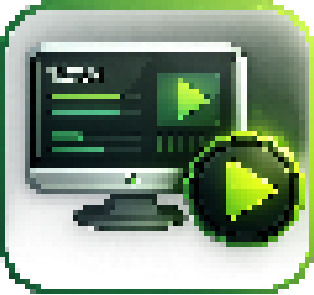
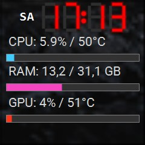
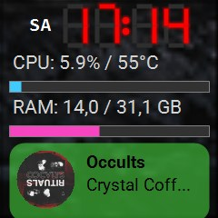
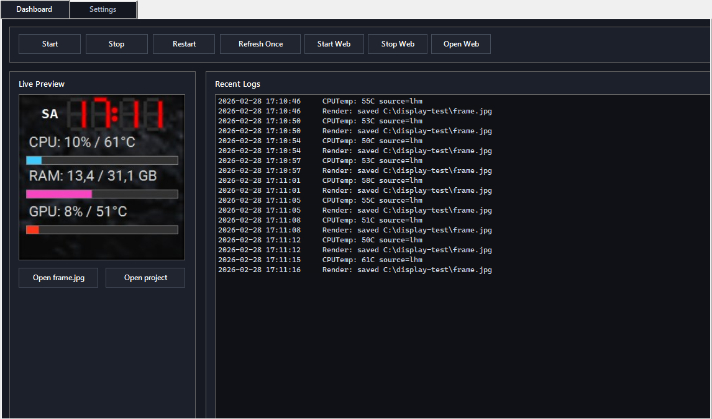
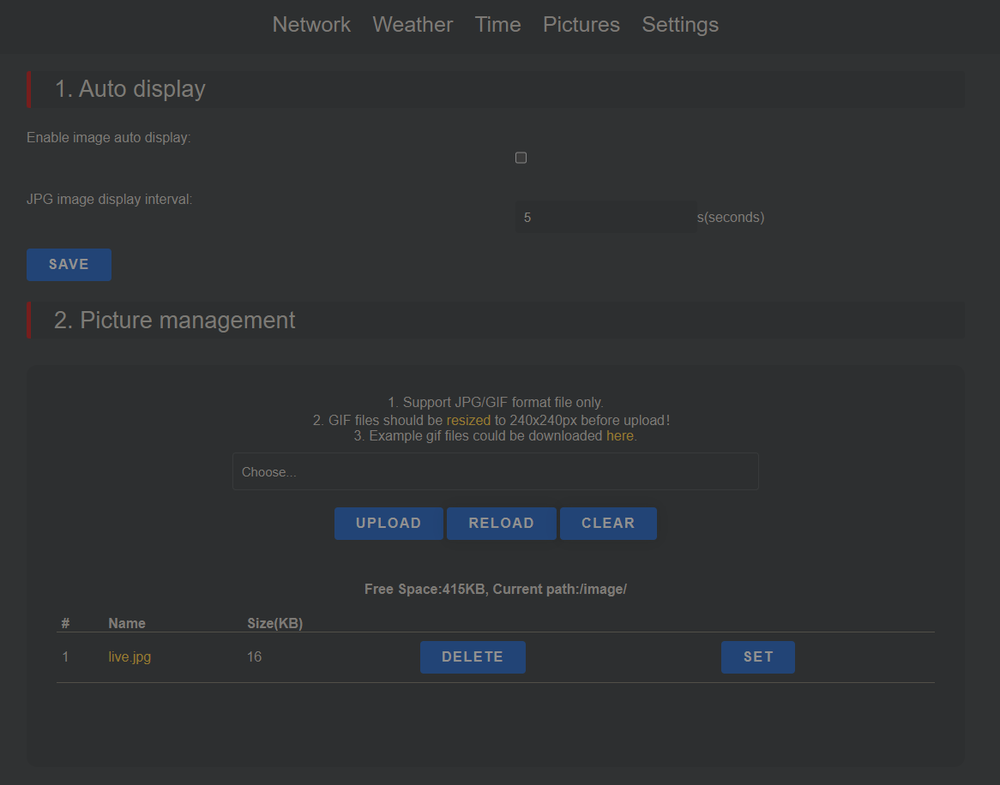
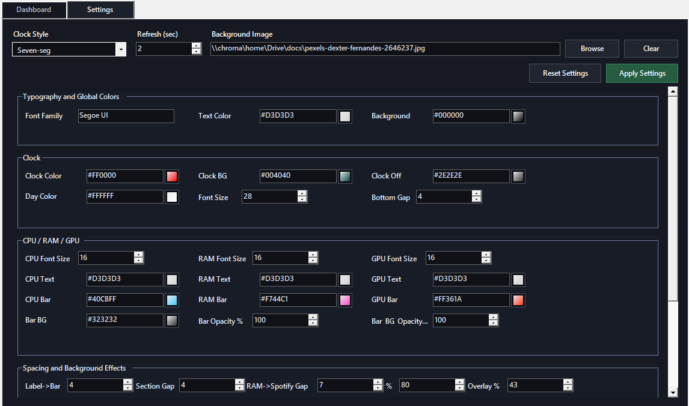

Ultra Display App
===========



Ultra Display v1.0

Screen previews:



Single user entry point:
- `app.cmd`
- Optional icon launcher: `create-shortcut.cmd` (creates `Ultra Display Panel.lnk`)

The user should only start `app.cmd`. It opens the control UI with:
- Start / Stop / Restart
- Refresh Once
- Start Web / Stop Web / Open Web (local network preview server)
- Live frame preview
- Recent log lines
- `Settings` tab with style JSON editor (Apply Settings auto-restarts services)

Dashboard UI:


Fancy launcher icon
-------------------
Run once:
```cmd
create-shortcut.cmd
```
This creates:
- `C:\display-test\Ultra Display Panel.lnk`
- Desktop shortcut `Ultra Display Panel.lnk`

Project layout
--------------
- `app.cmd` - single launcher for end users
- `secrets.json` - Spotify credentials
- `frame.jpg` - current rendered frame (generated locally, git-ignored)
- `logs\` - runtime logs and PID tracking
  - `logs\frame_debug.txt`
  - `logs\display-pids.json`
- `cache\` - Spotify cover cache
  - `cache\cover_cache.jpg`
  - `cache\cover_cache.url`
- `internal\` - implementation and dev scripts
  - `internal\app-ui.ps1`
  - `internal\scripts\*.ps1`
  - `internal\src\*`
  - `internal\dev\*.cmd`

Local web preview
-----------------
Dashboard includes:
- `Start Web`
- `Stop Web`
- `Open Web`

Behavior:
- Starts an on-demand local HTTP server on port `8090`
- Serves:
  - `/` (live preview page)
  - `/frame.jpg` (raw rendered frame)
- LAN access format:
  - `http://<your-pc-lan-ip>:8090/`

Runtime state file:
- `logs\web-preview-pid.json`

SmallTV-Ultra setup
-------------------
This app is intended for **GeekMagic SmallTV-Ultra** devices and uploads the rendered frame into the device picture server (`/image/`), then the device displays it as photo content.

Known-compatible device info:
- Model: `SmallTV-Ultra` (also reported as `Smalltv-Ultra`)
- Firmware: `Ultra-V9.0.45`
- Compatibility note: works with `V9.0.45` and older versions

Device web panel:
- Open: `http://192.168.0.243/image.html` (replace IP with your device IP)

Required device-side settings:
1. `Pictures` tab:
   - Delete all existing images from `/image/` (keep only `live.jpg`)
   - Disable image auto display
   - Save
   - Screenshot:
     
2. `Settings` tab:
   - Enable only `3. Photo Album` (checked)
   - Disable all other theme auto-switch options
   - Save
   - Screenshot:
     
3. Confirm file exists in picture manager:
   - `live.jpg` in current path `/image/`
   - If the display is not showing `live.jpg`, open `image.html`, find `live.jpg`, and press `SET`

How this project uploads:
- The uploader posts `frame.jpg` to:
  - `http://<device-ip>/doUpload?dir=/image/`
- Target filename is:
  - `live.jpg`
- Result on device:
  - `/image/live.jpg`

Important behavior note:
- If there are other images in `Pictures`, the device can loop between your app frame and other files.
- For stable display from this app, keep only `live.jpg` in `/image/`.

Reference manual (official):
- `https://github.com/GeekMagicClock/smalltv-ultra/blob/main/Latest%20GeekMagic%20SmallTV-Ultra%20User%20Manual%20V9.0.30.pdf`

Spotify setup
-------------
Copy template:
```cmd
copy secrets.example.json secrets.json
```

`secrets.json` format:
```json
{
  "SP_CLIENT_ID": "...",
  "SP_CLIENT_SECRET": "...",
  "SP_REFRESH_TOKEN": "..."
}
```

How to get values:
1. Create app in Spotify Dashboard: `https://developer.spotify.com/dashboard`
2. Copy Client ID and Client Secret
3. Add redirect URI, e.g. `http://127.0.0.1:8888/callback`
4. Authorize in browser:
   `https://accounts.spotify.com/authorize?client_id=YOUR_CLIENT_ID&response_type=code&redirect_uri=http%3A%2F%2F127.0.0.1%3A8888%2Fcallback&scope=user-read-currently-playing%20user-read-playback-state`
5. Exchange `code` for tokens (PowerShell):
```powershell
$id = "YOUR_CLIENT_ID"
$secret = "YOUR_CLIENT_SECRET"
$redirect = "http://127.0.0.1:8888/callback"
$code = "PASTE_CODE_HERE"
$basic = [Convert]::ToBase64String([Text.Encoding]::ASCII.GetBytes("$id`:$secret"))
Invoke-RestMethod -Method Post -Uri "https://accounts.spotify.com/api/token" `
  -Headers @{ Authorization = "Basic $basic" } `
  -Body @{
    grant_type = "authorization_code"
    code = $code
    redirect_uri = $redirect
  }
```
6. Put returned `refresh_token` in `SP_REFRESH_TOKEN`

CPU/GPU temperature sources
---------------------------
Current priority:
1. GPU: `nvidia-smi` (NVIDIA)
2. CPU: background `cpu-temp-agent.ps1` + `OpenHardwareMonitor` WMI
3. CPU fallback: `LibreHardwareMonitor` runtime (AMD/Intel)
4. CPU fallback: WMI thermal zone

External tools (not stored in this repo)
----------------------------------------
- LibreHardwareMonitor (official): `https://github.com/LibreHardwareMonitor/LibreHardwareMonitor/releases`
- OpenHardwareMonitor (official): `https://openhardwaremonitor.org/downloads/`
- NVIDIA `nvidia-smi` (comes with NVIDIA driver): `https://www.nvidia.com/Download/index.aspx`

Install/update command for CPU monitor runtimes:
```powershell
powershell -ExecutionPolicy Bypass -File internal\scripts\install-tools.ps1
```
This command downloads the tools from their official sources into local runtime folders (`internal\tools\...`) without versioning the binaries in git.

First run note (important)
--------------------------
- Third-party runtimes are installed automatically by `start-display.ps1`.
- Manual install command (optional):
  `powershell -ExecutionPolicy Bypass -File internal\scripts\install-tools.ps1`
- On first start, Windows may ask to allow/approve the hardware monitor runtime.
- You need to allow it once manually.
- After that, it runs minimized in the background through `cpu-temp-agent.ps1`.

Troubleshooting
---------------
- CPU agent writes cache to `cache\cpu_temp_agent.json`.
- If agent cannot read CPU sensors from OHM WMI, app tries LibreHardwareMonitor, then WMI.
- GPU temperature/load is independent and stays on `nvidia-smi`.

Settings tab
------------
`Settings` tab now has dedicated UI sections (no manual JSON editing needed):
- Global typography/colors
- Clock
- CPU/RAM/GPU text + bars
- Spacing/background effects
- Spotify box

Settings UI:


`Apply Settings` saves values into `settings.json` (style object) in background and restarts services.
